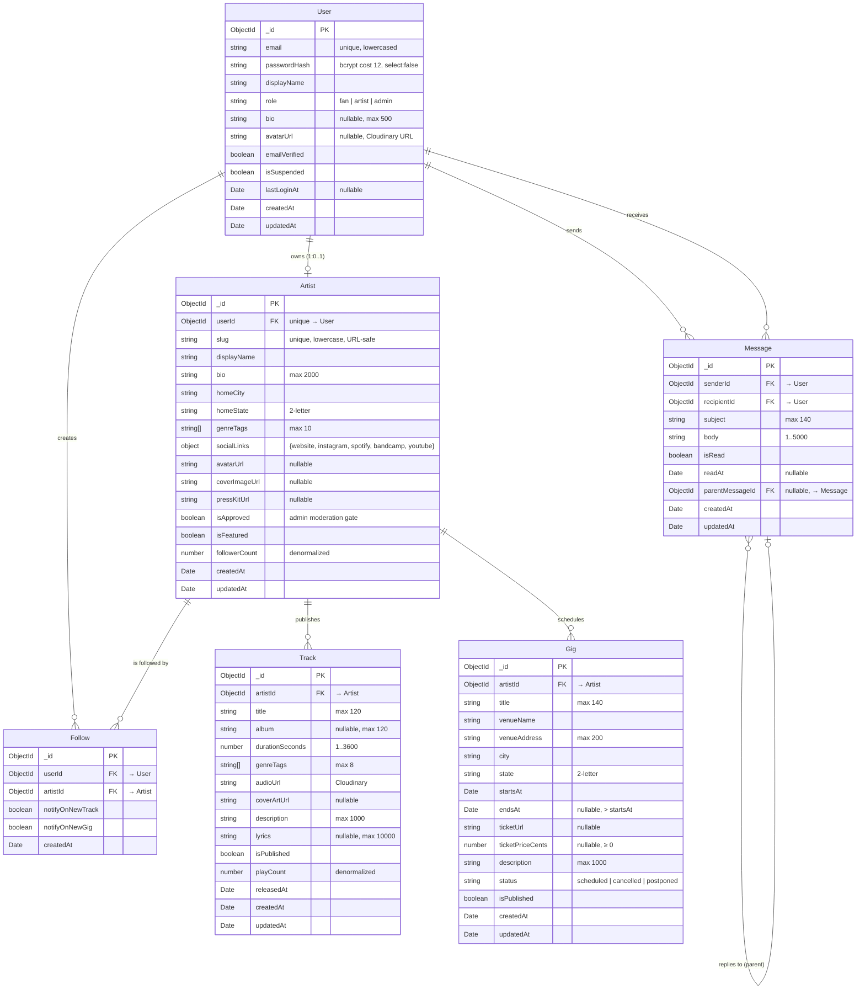

# StageOne — Entity Relationship Diagram

> Authoritative source: the Mongoose models in
> `packages/server/src/models/`. This document is regenerated when models
> change. Last updated for v0.2 schema lock.

The schema satisfies the WEB 268 requirement of "at least four data tables
with at least ten fields each" — five of the six collections clear the
10-field bar; **Follow** is intentionally lean because it's a junction
collection (one row per fan-artist edge).

| Collection | Fields | CRUD from frontend? | Notes                                  |
| ---------- | ------ | ------------------- | -------------------------------------- |
| User       | 11     | partial (read/edit) | Identity + auth; passwordHash hidden   |
| Artist     | 14     | yes (artist self)   | 1:1 with User; admin-moderated         |
| Track      | 13     | yes (artist self)   | Audio + metadata; play counter         |
| Gig        | 14     | yes (artist self)   | Future + past; status enum             |
| Follow     | 5      | create / delete     | Junction (User × Artist), unique       |
| Message    | 10     | yes (sender / recipient) | Threaded via parentMessageId      |

## Diagram

## Index strategy

Every collection has indexes tuned to the access patterns the spec calls out:

| Collection | Index | Drives |
| ---------- | ----- | ------ |
| User       | `{ email: 1 }` unique | login, registration uniqueness check |
| User       | `{ role: 1 }`         | admin-page user filtering            |
| Artist     | `{ slug: 1 }` unique  | public artist page lookup            |
| Artist     | `{ userId: 1 }` unique| 1:1 with User                        |
| Artist     | `{ isFeatured: -1, createdAt: -1 }` | home-page Featured strip |
| Artist     | `{ genreTags: 1 }`    | Discover genre filter                |
| Track      | `{ artistId: 1, isPublished: 1, releasedAt: -1 }` | artist-page track list |
| Track      | `{ isPublished: 1, releasedAt: -1 }` | "new this week" home strip |
| Track      | `{ genreTags: 1 }`    | Discover genre filter                |
| Gig        | `{ status: 1, isPublished: 1, startsAt: 1 }` | public Gigs page |
| Gig        | `{ city: 1, startsAt: 1 }` | "near you" home strip          |
| Gig        | `{ artistId: 1 }`     | artist-page gig list                 |
| Follow     | `{ userId: 1, artistId: 1 }` unique | de-dupe + "is X following Y?" |
| Follow     | `{ artistId: 1 }`     | follower-list query                  |
| Message    | `{ recipientId: 1, createdAt: -1 }` | inbox listing          |
| Message    | `{ recipientId: 1, isRead: 1 }` | unread badge count         |
| Message    | `{ parentMessageId: 1 }` | conversation walk                |

## Notable design decisions

**Money as integer cents.** `Gig.ticketPriceCents` is an `Number` storing
cents — never `Number` storing dollars. Float math is unsafe for currency.

**Denormalized counters.** `Artist.followerCount` and `Track.playCount` are
maintained at write time so card listings can render without a per-row
aggregation. Source-of-truth remains the Follow / play-events collections.

**Soft moderation gate.** New artists land with `isApproved=false`. Public
list and search queries always filter for `isApproved=true`. Admin tooling
is the only way the flag flips. This is the queue the admin user-story
covers (spec §5.1.3).

**Threaded messages without a Conversation collection.** A `parentMessageId`
chain is enough for v1.0. If thread depth or message volume grows, promote
to a Conversation collection in v1.1 (release plan §3.1 backlog).

**No `Comment` model in v1.0.** The needs assessment lists
"Comments and reactions" as a functional requirement, but the release plan
defers it past v1.0. When it lands it'll be a sibling of `Message` with
`(targetType, targetId)` fields.
